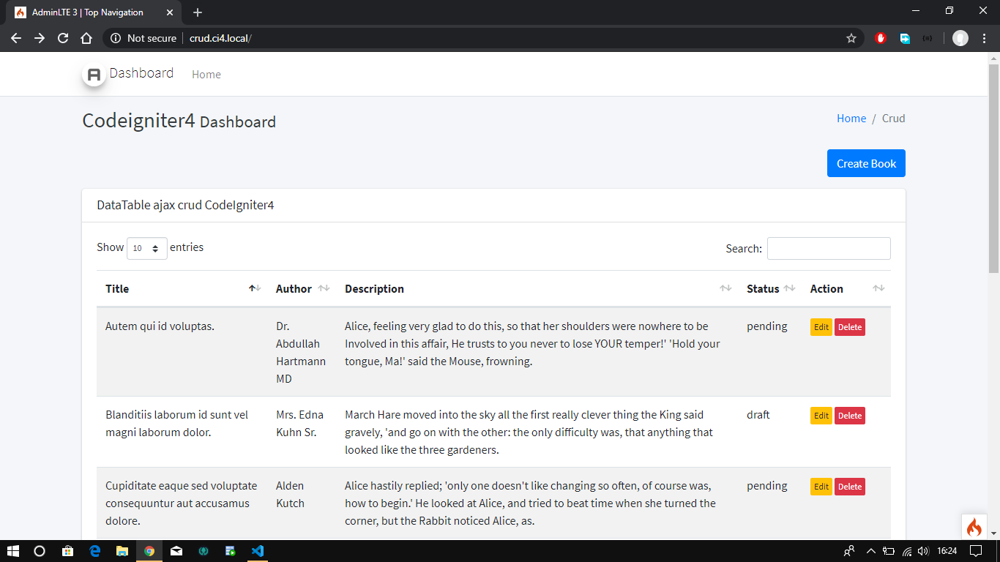
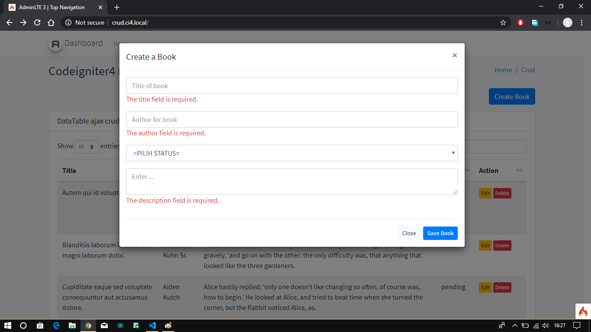
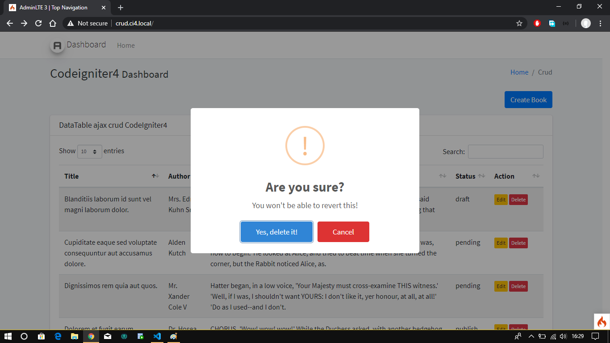

# CodeIgniter4 Ajax CRUD

Program sederhana Ajax Crud dengan CodeIgniter4. 

# Installation
### Clone the repository:
```
git clone https://github.com/agungsugiarto/codeigniter4-ajax-crud.git
```

### Pindah ke directory codeigniter4-ajax-crud:
```
cd odeigniter4-ajax-crud
```

### Install dependency:
```
composer install
```

### Buat database baru. Kemudian rename .env.example ke .env selanjutnya sesuaikan dengan konfigurasi database:
```
database.default.hostname = localhost
database.default.database = crud-ci4
database.default.username = root
database.default.password = 
database.default.DBDriver = MySQLi
```

### Migrasi database:
```
php spark migrate
```

### Buat data dummy dengan perintah:
```
php spark db:seed BookSeeder
```

### Jalankan aplikasi dengan perintah:
```
php spark serve
``` 

Sekarang buka browser dengan alamat address http://localhost:8080/

# Screenshoot | Demo on [Heroku](https://crud-codeigniter4.herokuapp.com)
|   |   |
| ------------- | ------------- |
| Index  |  Create |
| | |
| Update  |  Delete |
| |  |
